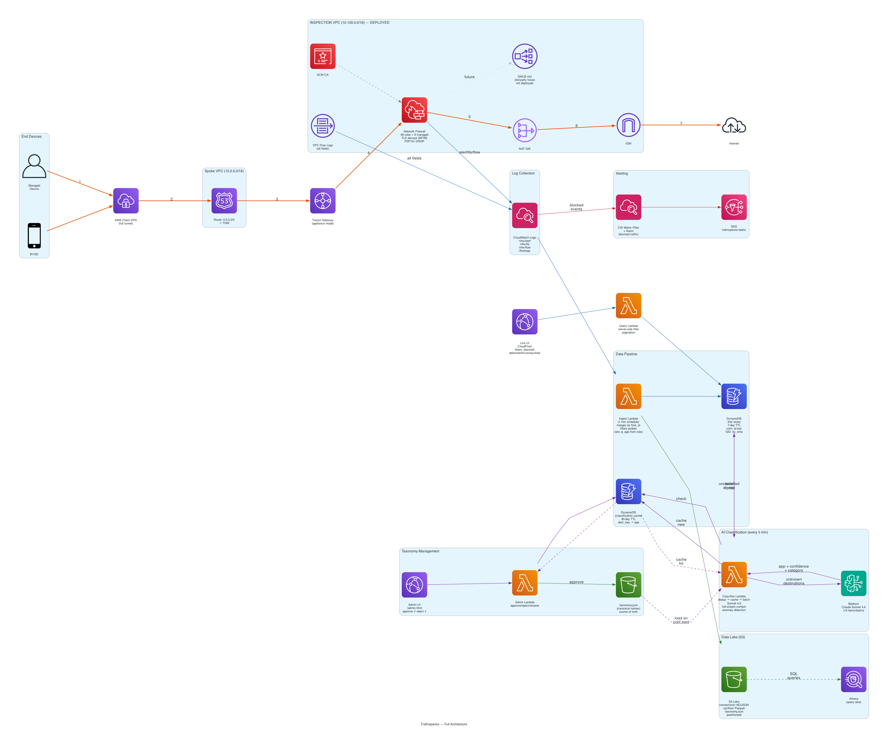
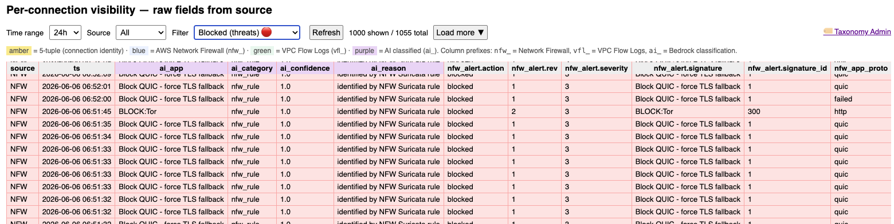
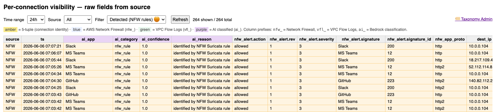
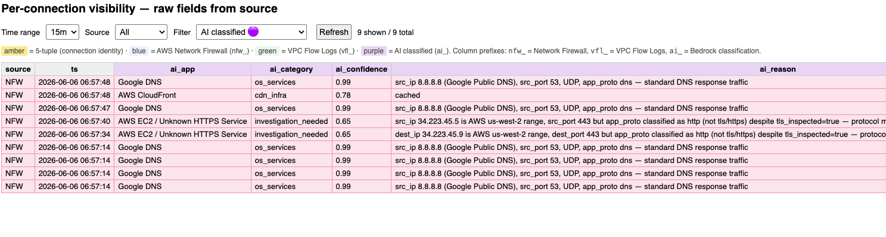
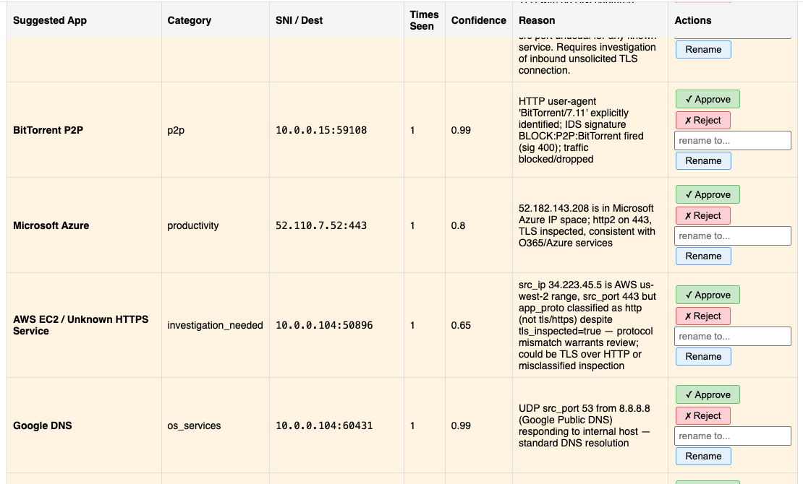

# Traffic Inspection POC — Consolidated Deliverable

Outbound device traffic, steered through **AWS Transit Gateway** into a central inspection VPC, inspected
by **native AWS Network Firewall** (with TLS decryption), classified per connection, and rendered as a
**native-vs-3rd-party** comparison UI. A **GWLB scaffold** is in place to drop in Palo Alto / Fortinet later.

**Goal:** show what AWS can see natively (the full visible surface), then position 3rd-party as a
"same data, deeper analysis" upgrade — opening the co-sell conversation.

---

## 1. Architecture



```
 Real device (laptop/phone) ──AWS Client VPN (full tunnel)──┐
                                                             ▼
                                Transit Gateway (appliance mode = flow symmetry)
                                                             │
                           ┌──────────── Inspection VPC ────────────┐
                           │ TGW subnets → AWS Network Firewall       │ ← TLS inspection (MITM, ACM CA)
                           │   Suricata stateful + DPI; QUIC blocked  │
                           │   98 app rules + 9 AWS managed groups    │
                           │   P2P/Tor/evasion = BLOCKED (drop)       │
                           │   logs: alert / tls / flow               │
                           │ NAT GW → IGW → Internet (real apps)      │
                           │ [GWLB + endpoint service = 3rd-party slot, no appliance yet] │
                           └──────────────────────────────────────────┘
   logs │
   NFW (CloudWatch) + VPC Flow Logs
        ▼
  Ingest Lambda (scheduled) ──► DynamoDB (hot store, 7-day TTL) ◄─ Query Lambda (Function URL)
        │                                    ▲
        │                         AI Classifier Lambda (1/min, Bedrock Haiku)
        └───────────────► S3 lake (connections NDJSON + vpcflow Parquet, partitioned)
                                      └─► [ Athena / SageMaker / Bedrock — AI tier substrate ]
                                                         ▲
        Static JS UI on CloudFront (time-range + source + threat/AI filter) ── fetch ──┘
```
Transparent inspection — **no proxy on the client**; the route table forces all egress through the firewall.
The UI shows **only raw fields straight from each source** (no derived values); AI-derived app classification
is a planned tier (§5), surfaced as a separate, clearly-labeled column when built.

---

## 2. What's deployed (live)

| Item | Value |
|---|---|
| Region / Account | `us-east-2` / `<ACCOUNT_ID>` |
| Live comparison UI (CloudFront) | **<CLOUDFRONT_UI_URL>/index.html** — time-range + source + threat/AI filters |
| Query API (Lambda Function URL) | `<QUERY_FUNCTION_URL>` *(unauthenticated — POC only)* |
| Hot store (live UI) | DynamoDB `trafinspector-connections` (7-day TTL) |
| Data lake (AI substrate) | S3 `trafinspector-lake-…` — `connections/` NDJSON + `vpcflow/` Parquet, partitioned |
| AI Classifier | Lambda `trafinspector-classifier` (every 1 min, Bedrock Haiku) |
| Inspection VPC / TGW | `<INSPECTION_VPC_ID>` / `<TGW_ID>` |
| NFW endpoints / TLS | `us-east-2a`,`us-east-2b` · TLS inspection **enabled** (self-signed CA in ACM) |
| NFW rules | 98 custom (app detection + P2P/evasion blocking) + 9 AWS managed threat groups |
| 3rd-party slot (GWLB) | endpoint service `<GWLB_ENDPOINT_SERVICE>` (no appliance yet) |
| Device ingress | AWS Client VPN `<VPN_ENDPOINT_ID>` (full tunnel) · profile `trafinspector.ovpn` + CA `trafinspector-ca.crt` |
| SNS alerts | `trafinspector-alerts` — email on blocked/threat traffic |
| Run rate | **~$2.0/hr** (+~$0.05/hr per connected VPN client); tear down with `terraform destroy` |

---

## 3. Per-connection visibility — native vs 3rd-party

The UI renders one row per connection with a **source-grouped, color-coded header** (🟩 Flow Logs · 🟦 Network
Firewall · 🟥 3rd-party). **Both native engines see the same packets** (GENEVE just transports the original
packet); the difference is what each *derives*. The columns below mirror the live UI.

| Column | Source | Meaning / usefulness |
|---|---|---|
| **src_ip, dst_ip, src_port, dst_port, proto** (amber) | 🟩 VPC Flow Logs *(also NFW)* | the **5-tuple** = connection identity key |
| bytes, pkts | 🟩 VPC Flow Logs *(here from NFW netflow)* | volume per flow — behavioral signal |
| SNI | 🟦 NFW (no decryption) | destination from the TLS ClientHello — the cheap signal; works even un-decrypted |
| app_proto (`tls`/`http2`) | 🟦 NFW | decrypted (`http2`) vs handshake-only (`tls`) |
| matched rule | 🟦 NFW | the Suricata signature hit (e.g. `Zoom`, `MS Teams`) — explicit app tag |
| category | 🟦 NFW | URL/domain category (managed rules) |
| method, url | 🟦 NFW (**decrypted**) | the actual request — reveals app *function* |
| user-agent | 🟦 NFW (**decrypted**) | client app + version — a strong native identifier |
| http status, content-type | 🟦 NFW (**decrypted**) | response metadata |
| TLS ver, cert subject, cert issuer | 🟦 NFW | TLS/certificate metadata from the handshake |
| **JA3 / JA4** | 🟥 3rd-party | **not emitted by native NFW** → appliance-only |
| **Palo Alto: App-ID / User-ID / DLP / WildFire** | 🟥 3rd-party | the upgrade story — deeper analysis on the *same* data |

The live UI shows **only raw source fields** (no derived/merged columns) plus **time-range + source dropdowns**.
A connection may carry SNI *or* http_host (not both): SNI is from the TLS handshake event, http_host from the
decrypted HTTP/2 event (on a decrypted flow NFW logs the host, no separate SNI record) — either identifies the
app. Some L7/cert columns show `-` when the simple test request (GET `/`) doesn't populate them; they exist to
show *capability* and fill with real traffic. A unified **AI-classified application** column is a planned tier
(§5) — when built it appears as a separate, clearly-labeled column, never mixed with raw NFW fields.

**Join key:** the full 5-tuple (ephemeral src ports recycle, so port-only merging would wrongly blend flows).

**Shared ceiling (neither native nor 3rd-party can see):** mTLS-to-origin payload, ECH-hidden SNI, QUIC payload
(we block QUIC to force TLS fallback).

---

## 4. Cost (recalculated for the deployed stack)

**Marginal (per-GB inspected) is unchanged: ~$0.105/GB** = NFW data `$0.065` + TGW data `$0.04` (NAT waived when
chained). The analytics/UI/VPN we added are **fixed or volume-trivial**, not per-GB: DynamoDB (on-demand writes),
S3 lake storage (metadata, ~tiny vs payload), 2 Lambdas, CloudFront, and log ingestion scale with *connection
count*, not inspected GB — a few $/month at POC volume.

**Fixed monthly (us-east-2 list, 2-AZ, TLS on, 720 hr):**

| Component | $/mo |
|---|---|
| NFW endpoints (2 AZ) | 568.80 |
| NFW TLS Advanced Inspection (2 AZ) | 704.16 |
| TGW attachments (spoke + inspection) | 72.00 |
| Client VPN endpoint association | 72.00 |
| GWLB (scaffold, no appliances) | 9.00 |
| NAT Gateway hourly | 0 (waived, chained with NFW) |
| DynamoDB + S3 + Lambdas + CloudFront + logs | ~15–25 |
| AI Classifier (Bedrock Haiku, 1/min) | ~5–10 |
| **Fixed total** | **≈ $1,450/mo (~$2.0/hr)** |

**Blended $/GB** (fixed ≈ $1,450 + $0.105/GB variable):

| Volume/day | $/mo | $/GB |
|---|---|---|
| 100 GB | ~$1,770 | ~$0.590 |
| 10 TB | ~$32,955 | ~$0.110 |
| 1 PB | ~$3,151,455 | ~$0.105 |

TLS inspection adds **no per-GB charge** (hourly only) → free at scale. Excludes standard internet egress data
transfer (~$0.09/GB) which applies to the traffic itself, not inspection. The only PB-scale lever is
**selective inspection** (deep-inspect a subset). Core NFW/TGW model + sweep in `cost.md` / `cost_calc.py`.

---

## 5. AI / application classification — **LIVE (Tier 0 + Tier 2)**

The classification pipeline is deployed and operational:

- **Tier 0 — deterministic (NFW rules):** 98 Suricata rules match known apps by SNI/HTTP/user-agent.
  Handles ~80% of traffic inline at wire speed. Zero AI cost.
- **Tier 2 — Bedrock LLM (Claude Sonnet 4.6):** Classifies unknown connections every 5 min with
  dedup + cache + batch. Full-stream context including tcp-flags, anomaly detection (entropy, cert
  errors). ~$0.05/day at steady state.
- **Taxonomy system:** Human-in-the-loop approval. AI suggests → admin approves → deterministic forever.
  See [taxonomy.md](taxonomy.md) for details.

**Not yet built:**
- **Tier 1 — ML (SageMaker):** Behavioral classifier for obfuscated P2P, tunneling. Planned for when
  signature + LLM aren't sufficient for specific evasion patterns.

---

## 6. Setup & Deployment (from scratch)

### Prerequisites

- **AWS CLI** configured with a profile that has admin access
- **Terraform** >= 1.5
- **Python 3.12** (for diagrams generation)
- **Graphviz** (`brew install graphviz`) — for architecture diagrams
- **diagrams** (`pip install diagrams`) — Python AWS diagram library
- AWS account with permissions for: VPC, EC2, EKS, NFW, TGW, ACM, Lambda, DynamoDB, S3, CloudFront, Bedrock, CloudWatch, SNS, API Gateway

### Step 1 — Deploy infrastructure

```bash
cd terraform
terraform init
AWS_PROFILE=<YOUR_PROFILE> terraform apply    # ~10 min (NFW + CloudFront take longest)
```

This creates: Inspection VPC, TGW, NFW (with TLS decryption), Spoke VPC, Client VPN,
CloudFront UI, API Gateway, DynamoDB, S3 lake, Lambdas (ingest + query + classifier + admin),
SNS alerts, and the classification cache table.

### Step 2 — Generate VPN profile

After deploy, assemble the `.ovpn` client profile:

```bash
cd terraform

# Extract certs from Terraform state
terraform output -raw vpn_client_cert_pem > ../trafinspector-client.crt
terraform output -raw vpn_client_key_pem > ../trafinspector-client.key

# Get the CA cert (used for both TLS inspection + VPN auth)
terraform show -json | python3 -c "
import sys,json
state=json.load(sys.stdin)
for r in state.get('values',{}).get('root_module',{}).get('resources',[]):
    if r['address']=='tls_self_signed_cert.ca':
        print(r['values']['cert_pem'])
        break
" > ../trafinspector-ca.crt

# Get VPN endpoint ID
VPN_ID=$(terraform output -raw clientvpn_endpoint_id)

# Create .ovpn profile
cat > ../trafinspector.ovpn << EOF
client
dev tun
proto udp
remote ${VPN_ID}.prod.clientvpn.us-east-2.amazonaws.com 443
remote-random-hostname
resolv-retry infinite
nobind
remote-cert-tls server
cipher AES-256-GCM
verb 3

<ca>
$(cat ../trafinspector-ca.crt)
</ca>

<cert>
$(cat ../trafinspector-client.crt)
</cert>

<key>
$(cat ../trafinspector-client.key)
</key>
EOF

echo "VPN profile: ../trafinspector.ovpn"
```

Trust the inspection CA on your device (required for TLS decryption):
```bash
# macOS
sudo security add-trusted-cert -d -r trustRoot -k /Library/Keychains/System.keychain trafinspector-ca.crt

# Linux
sudo cp trafinspector-ca.crt /usr/local/share/ca-certificates/ && sudo update-ca-certificates
```

Connect with any OpenVPN-compatible client (Tunnelblick, OpenVPN Connect, etc.).

### Step 3 — Set environment variables

```bash
# Add to ~/.zshrc
export AWS_PROFILE=<YOUR_PROFILE>
export TAXONOMY_API="<API_GATEWAY_URL>/admin"    # for taxonomy.sh CLI
```

### Step 4 — Verify

```bash
# Connect to VPN, then:
./nfw-test.sh detect     # generate traffic (apps + P2P + AI triggers)
./nfw-test.sh status     # check NFW detections

# Open the UI:
terraform output ui_url  # CloudFront URL
```

### Step 5 — Manage taxonomy

```bash
./taxonomy.sh list                          # view pending AI classifications
./taxonomy.sh approve <app_name> <category> # make deterministic
./taxonomy.sh reject <app_name>             # ignore
# Or use the admin UI: <CLOUDFRONT_URL>/admin.html
```

## 7. Testing traffic inspection

Connect to VPN, then run:
```bash
./nfw-test.sh detect     # generate all traffic types
./nfw-test.sh status     # check NFW detections (wait 30-60s)
```

### Blocked traffic (P2P, Tor, QUIC)


### Detected by NFW rules (Slack, Zoom, AI services)


### AI classified (unknown apps identified by Bedrock)


### Taxonomy Admin (approve/reject AI suggestions)


### How `ai_app` is populated

| Source | When | `ai_app` value | `ai_category` |
|---|---|---|---|
| NFW Suricata rule match | `alert.signature` exists | Copied from `alert.signature` (e.g., "Zoom", "Slack", "AI:OpenAI") | `nfw_rule` |
| Bedrock classifier | No rule match, classifier identifies | Set by Sonnet (e.g., "Juniper Mist Edge", "Apple Push Notifications") | Model-assigned (e.g., `vendor_infra`, `os_services`) |
| Unclassified | Neither matched | `unclassified` | `unknown` |

NFW provides `app_proto` (detected protocol: `http2`, `tls`, `dns`) and `alert.signature` (rule match name).
When a Suricata rule fires, we copy its signature directly to `ai_app` for a **unified app identity column**
— no Bedrock call needed. AI only processes connections NFW rules missed.

### Retriggering classification

To reclassify a wrongly cached app:
```bash
# Reject the bad classification (removes from cache)
./taxonomy.sh reject "<app_name>"

# Or reject via admin UI: click ✗ on the item

# Force classifier to re-process (runs automatically every 5 min, or manually):
AWS_PROFILE=<YOUR_PROFILE> aws lambda invoke --function-name trafinspector-classifier --region us-east-2 /tmp/c.json
```

After rejection, the destination will be re-sent to Bedrock on the next classifier cycle with
fresh context (including `tcp-flags` for probe vs real connection detection).

## 7. How to read results

- **Live UI:** open the CloudFront URL above. Use the **time-range** (5m–30d) and **source** (NFW/FlowLogs)
  dropdowns; the table renders every **raw field** per connection from DynamoDB (1-min ingest), 5-tuple in amber,
  rows tinted by source. No derived columns.
- **NFW logs (the detail):** CloudWatch `/trafinspector/nfw/alert` (rule matches + decrypted HTTP),
  `/trafinspector/nfw/tls` (SNI, TLS errors), `/trafinspector/nfw/flow` (netflow bytes/pkts).
  Example decrypted event shows `:authority=zoom.us`, `GET /`, `user-agent`, `app_proto=http2`.
- **VPC Flow Logs:** `/trafinspector/flowlogs` — 5-tuple + `pkt-srcaddr/pkt-dstaddr` (original IPs behind TGW/NAT).

---

## 8. Next steps

### Data storage architecture
Two-tier storage by design:
- **DynamoDB (hot store)** — last 7 days, single-digit-ms queries for the live UI. TTL auto-expires
  old records. On-demand pricing (pennies at POC volume). Trade-off: no complex queries/joins.
- **S3 data lake (cold store)** — all time, partitioned NDJSON + Parquet. Queryable via Athena (1-3s
  latency) for analytics, AI/ML, and long-term retention. Cheap at any scale.

Both stores receive the same data. DynamoDB serves the dashboard; S3 serves the AI tier and compliance.
Dropping DynamoDB and querying S3/Athena directly is possible but adds latency to the UI.

### AI traffic classification (live — Tier 2)
Connections NFW rules don't match are classified by **Claude Sonnet 4.6** via Bedrock. The classifier
runs every 5 minutes with three cost optimizations:

1. **Deduplicate** — group all events by `(SNI:port)` or `(dest_ip:port)`. Classify once per unique
   destination, apply label to all matching records. Reduces items from thousands to ~50-200 unique tuples.
2. **Cache** — DynamoDB table `trafinspector-classifications` stores known destinations (30-day TTL).
   On subsequent runs, cached destinations skip Bedrock entirely. After warm-up, ~99% of traffic is
   served from cache.
3. **Batch** — all unknown destinations sent in a single Bedrock call (≤15 items per invocation).
   One API call classifies 15 destinations × N events each.

**Why DynamoDB for cache (not ElastiCache/Memcached):**
- Classifier runs every 5 min → 288 times/day, ~4000 reads/day = **$0.001/day**
- DynamoDB read latency (<10ms) is irrelevant vs Bedrock latency (3-5s)
- ElastiCache would cost $13+/mo to save 9ms on a function that waits seconds for AI
- DynamoDB Global Tables enables multi-region cache replication at no extra effort
- Same service already in the architecture — no new infra to manage

**Classification logic:**
- Analyzes ALL fields: SNI, dest IP, port, app_proto, HTTP headers, TLS cert info, user-agent
- Computes anomaly signals: SNI entropy (DGA detection), TLS cert errors (pinning), missing app_proto
- Outputs: `ai_app` (name), `ai_confidence` (0-1), `ai_category`, `ai_reason`
- Items marked `investigation_needed` = suspicious but unidentifiable (shadow IT, tunnels)

**Cost at scale:**
| Phase | Bedrock calls/day | Cost/day |
|---|---|---|
| Cold start (no cache) | ~50-100 | ~$0.50 |
| Warm (cache populated) | ~5-10 (new destinations only) | ~$0.05 |
| Steady state | ~2-5 | ~$0.02 |

**Triggering reclassification:**
If a cached classification is wrong (e.g., port scan misidentified as IMAP), reject it and it
will be reclassified on the next cycle with fresh data (including `tcp-flags` for probe detection):
```bash
# Reject a bad classification (removes from cache, forces reclassification)
./taxonomy.sh reject "IMAP Email Service"

# Reject via admin UI: click ✗ on the item in /admin.html

# Force full reclassification run
AWS_PROFILE=<YOUR_PROFILE> aws lambda invoke --function-name trafinspector-classifier --region us-east-2 /tmp/c.json
```
New flow log entries now include `tcp-flags` — the classifier uses this to distinguish real connections
(SYN+ACK = established) from probes (SYN-only = port scan). Rejected cache entries get reclassified
with this improved context on the next cycle.

### Ingestion model
- **Real-time ingestion (not yet switched):** Replace scheduled Lambda with CloudWatch Logs
  subscription filter → Lambda → DynamoDB for sub-second UI updates. Current POC uses scheduled
  ingestion (every 1-5 min via CloudWatch Logs Insights query) which is simpler and sufficient for demos.
  SNS threat alerting is already near-real-time (metric filter triggers on log arrival, no Lambda delay).
- **Tier-1 ML (SageMaker):** Behavioral classifier for obfuscated P2P/tunneling where signatures + LLM
  aren't sufficient. Not yet built.
- **3rd-party inline:** register a GWLB appliance (Palo Alto / Fortinet) → JA3/JA4 + App-ID/User-ID/DLP/WildFire
  on the *same* flows (set `appliance_ami_id`).
- **Athena queries:** hook Athena to S3 lake for ad-hoc SQL over all historical traffic.

## Documents
| File | Purpose |
|---|---|
| [POC-README.md](POC-README.md) | This file — full POC overview |
| [taxonomy.md](taxonomy.md) | AI classification system + approval workflow |
| [deliverable.md](deliverable.md) | Customer-facing deliverable (Q1-Q5 mapping) |
| [cost.md](cost.md) | Cost analysis + 100 TB/day extrapolation |
| [parameters.md](parameters.md) | All NFW + VPC Flow Log fields reference |
| [Inspection-Field-Catalog.md](Inspection-Field-Catalog.md) | What each inspection engine can see |
| [comparison-native-vs-paloalto.md](comparison-native-vs-paloalto.md) | Native vs 3rd-party field comparison |
| [CONTRIBUTING.md](CONTRIBUTING.md) | Deployment rules (no-taint policy) |
| [nfw-vs-flowlogs-fields.md](nfw-vs-flowlogs-fields.md) | NFW vs Flow Logs differences |

## Architecture Diagrams
| File | Shows |
|---|---|
| [architecture-full.png](architecture-full.png) | Complete system: inspection → classification → alerting → data lake |
| [architecture-taxonomy.png](architecture-taxonomy.png) | Taxonomy learning + approval flow |

## Files
`terraform/` — vpc, firewall+TLS, routes, gwlb scaffold, flowlogs, ddb, ui+CloudFront, query Function URL,
S3 lake, spoke+generator, tls/ACM CA, clientvpn · `lambda/ingest.py` + `lambda/query.py` · `ui/index.html` ·
`trafinspector.ovpn` + `trafinspector-ca.crt` (VPN profile + CA) ·
`comparison-native-vs-paloalto.md` · `Inspection-Field-Catalog.md` · `nfw-vs-flowlogs-fields.md` ·
`cost.md` · `cost_calc.py`
