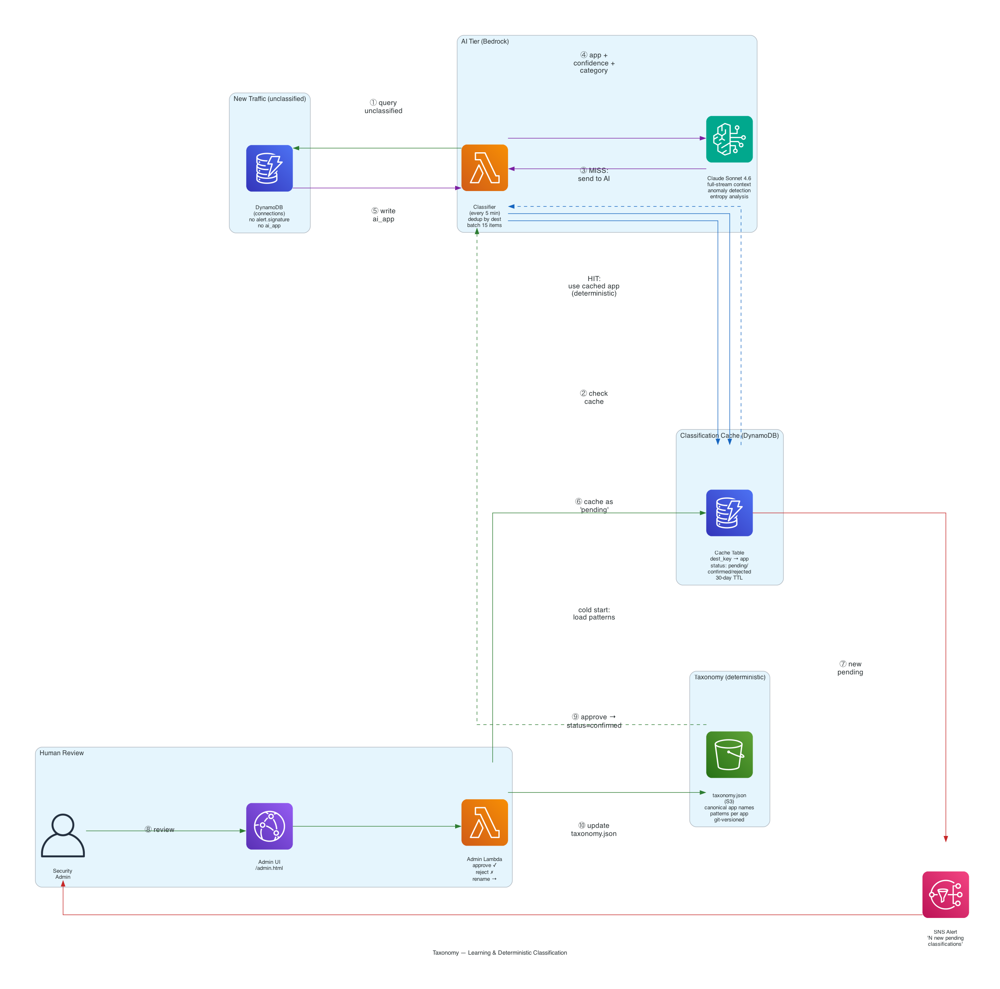

# Taxonomy — Deterministic App Classification System



## Problem

LLMs are non-deterministic. Claude might return "Microsoft 365" one time and "MS Teams" the next.
For traffic inspection at scale, we need **consistent, repeatable app labels** across all regions and accounts.

## Solution: Two-Tier Taxonomy with Staging

```
┌─────────────────────────────────┐     ┌─────────────────────────────────────┐
│  DETERMINISTIC (taxonomy.json)  │     │  AI STAGING (DynamoDB pending)      │
│                                 │     │                                     │
│  microsoft_365                  │     │  "pending:juniper_mist" (seen 47x)  │
│  zoom                           │     │  "pending:deep_seek_ai" (seen 12x)  │
│  slack                          │     │  "pending:notion" (seen 3x)         │
│  ...40+ canonical apps          │     │                                     │
│                                 │     │         │ human reviews             │
│  Once here = NEVER calls AI     │◄────│─────────┘ approve/reject/rename     │
│  Served from cache forever      │     │                                     │
└─────────────────────────────────┘     └─────────────────────────────────────┘
```

## How Classification Works

### Step 1: NFW Rules (instant, inline)

98 Suricata rules match known app patterns by SNI/HTTP/user-agent. These fire in real-time
at the firewall level — no AI involved. Covers ~80% of traffic.

### Step 2: AI Classifier (every 5 min, batch)

For connections NFW rules didn't match:

1. **Deduplicate** — group all events by `(SNI:port)` or `(dest_ip:port)` → unique destinations
2. **Check cache** — DynamoDB lookup. If `status=confirmed` → use cached label (deterministic). STOP.
3. **Check taxonomy.json** — pattern match against known apps. If matched → use canonical name. STOP.
4. **Call Bedrock** (Claude Sonnet 4.6) — send all fields + anomaly signals → get classification
5. **Write to cache** as `status=pending` with `seen_count=1`
6. **Apply label** to all DynamoDB items for that destination

### Step 3: Human Review (async)

Pending items accumulate until reviewed. You approve once → deterministic forever.

## Cache States

| `status` | Meaning | AI called? | Deterministic? |
|---|---|---|---|
| `pending` | AI suggested a name, awaiting human review | Once | No (could change if rejected) |
| `confirmed` | Human approved — canonical name locked | Never again | ✅ Yes |
| `rejected` | Human said "ignore this" | Never again | ✅ Yes (ignored) |
| *(missing)* | Never seen before | Next run | No |

## How to Approve / Reject

### Option 1: Admin UI

Open `<CLOUDFRONT_UI_URL>/admin.html`

- Shows all pending items with: app name, category, SNI/dest, times seen, confidence, reason
- **Approve** ✓ → moves to `taxonomy.json` + cache `status=confirmed`
- **Reject** ✗ → marks `status=rejected` (ignored forever)
- **Rename** → approve with a different canonical name (e.g., rename "ms_teams" → "microsoft_365")

### Option 2: CLI

```bash
./taxonomy.sh list                                # show pending items
./taxonomy.sh approve juniper_mist vendor_infra   # approve with category
./taxonomy.sh reject random_noise                 # ignore it
./taxonomy.sh rename ms_teams microsoft_365 productivity  # fix the name + category
```

## After Approval — What Happens

```
1. Cache entry updated: status = "confirmed", app = canonical name
2. taxonomy.json in S3 updated: new pattern added to the app's pattern list
3. ALL future connections to that destination:
   → Classifier checks cache → CACHE HIT (confirmed) → returns canonical name
   → Zero Bedrock calls, zero non-determinism
```

## Notifications

- SNS alert fires when pending count exceeds threshold
- Email: "5 new pending classifications need review"
- Review weekly or when notified — pending items don't block inspection, they just show as "pending:name" in the UI

## Multi-Account / Multi-Region

```
Central Account (us-east-2)
├── S3: taxonomy.json (cross-account read)
├── DynamoDB Global Table: trafinspector-classifications
│   └── Replicated to all regions automatically
└── SNS: pending alerts

Any region / any account:
├── Classifier reads Global Table cache → cache hit = no AI
├── New destination → writes pending to Global Table
├── Pending visible in ALL regions instantly
└── Approve in one region → confirmed everywhere
```

**Cost of shared cache:**
- DynamoDB Global Table: ~$0.25/mo per replica region
- S3 cross-account read: pennies
- A classification learned in us-east-2 is available in eu-west-1 within <1 second

## Why DynamoDB (Not ElastiCache/Memcached)

- Classifier runs every 5 min → 288 invocations/day
- ~4000 cache reads/day = **$0.001/day** on DynamoDB
- DynamoDB read latency: <10ms — irrelevant when Bedrock takes 3-5 seconds
- ElastiCache would cost $13+/mo to save 9ms on a function that waits seconds for AI
- DynamoDB Global Tables: built-in multi-region replication, no extra infra
- Same service already in the architecture — no new components to manage

## Cost at Scale

| Phase | Bedrock calls/day | Cost/day |
|---|---|---|
| Cold start (empty cache) | ~50-100 | ~$0.50 |
| Warm-up (first week) | ~5-10 new destinations/day | ~$0.05 |
| Steady state | ~2-5 genuinely new apps | ~$0.02 |

After warm-up, **99%+ of traffic is classified from cache** — the AI model is called only for
destinations never seen before. Each new destination is classified once, reviewed once, and
then deterministic forever.

## Files

| File | Purpose |
|---|---|
| `taxonomy.json` | Canonical app registry (checked into git, uploaded to S3) |
| `taxonomy.sh` | CLI for approve/reject/rename |
| `terraform/ui/admin.html` | Admin UI for reviewing pending classifications |
| `terraform/lambda/admin.py` | Admin API Lambda (CRUD for taxonomy) |
| `terraform/lambda/classifier.py` | AI classifier with dedup + cache + batch |
| `terraform/classifier.tf` | Terraform: classifier Lambda + cache table + schedule |
